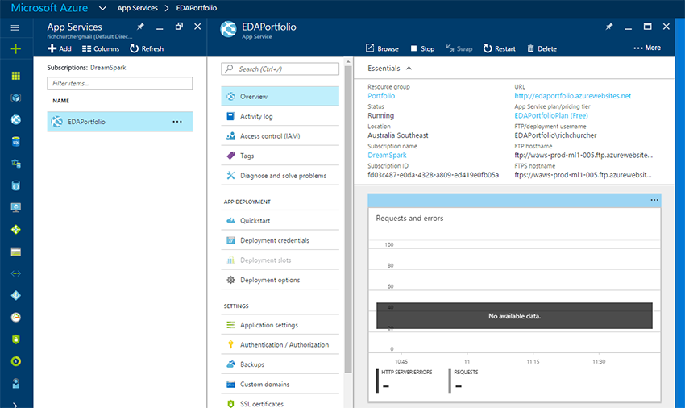

# Deployment

Let's try to get this thing world-visible. Right click on the `Portfolio` project and choose _Publish..._, then choose _Microsoft Azure App Service_. You'll see a dialog like this one:

Note that you won't see "DreamSpark" as the subscription plan (that's something that doesn't really exist anymore, they rebranded it as "Microsoft Imagine") but they do have a similar free tier and if you've already signed up for Visual Studio Dev Essentials previously in Phase 4 to get the Pluralsight subscription, you will also have gotten some free Azure credits.

It's worth noting that you should be very careful not to accidentally get charged for using Azure! It is possible to do this entire module without paying any money. You should always be working from a free tier/free credits plan.

You will probably need to create a new resource group and app service plan. Choose locations close to you (Southeast Australia, for example). When you submit these details, you'll see a dialog like this one:

Obviously, you won't be able to call yours `edaportfolio` because I've already stolen that URL! At this point, you can click _Publish_ and you'll soon be looking at the 'finished' product.

## SQLServer

But wait, there's more! Unfortunately your newly-published site is not quite functional yet. Although you might be able to browse around, anything database-related will fail. Unsurprisingly, we can't just use our local database on Azure: we need to do some more configuration first.

In your browser, visit [the Azure Portal](https://portal.azure.com) and sign in with your Microsoft account. Click on _App Services_, then the name of your portfolio application. You'll be presented with an awful lot of information about the app... take some time to explore, but probably don't change anything just yet. Click through the various options to get a feel for what's possible.

Now go all the way back to the left hand side and click on 
