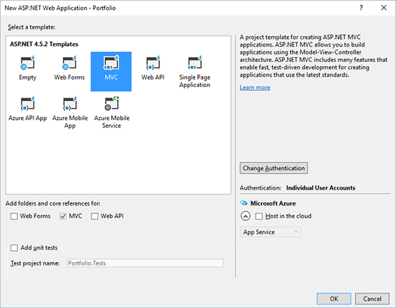

# Scaffolding your new portfolio

So let's make a portfolio site. The site should collect your various projects and work history in one easy to update location. You could also choose to do something different, with very much the same structure... examples include a photo album, collection of links, simple blog engine, and so on.

Visual Studio takes care of quite a bit of this for you. Start a new project with _File_ / _New_ / _Project_ (or Ctrl-Shift-N).

Notice several things here:

 - In the left-hand column, _Web_ is highlighted under _C#_.
 - .NET Framework 4.5.2 is selected in the dropdown at the top.
 - The ASP.NET Web Application template is selected. You don't want anything that says .NET Core, at least not for now.
 - The Application Insights checkbox is deselected on the right hand side. Until you know what these are, you don't need 'em.
 - A name has been provided. Pay attention to where Visual Studio plans to save your solution: by default, it'll be in the projects directory but you may prefer a work directory elsewhere.
 - The boxes for _Create directory for solution_ and _Create new Git repository_ are both checked: you want these.

When you click OK, you'll be taken to a screen like this one:

Things to look out for:

 - Make sure MVC is selected, as shown above
 - Authentication (on the right) should say _Individual User Accounts_.
   - This will take care of quite a bit of automatic scaffolding for you, including the database. You'll want this option most of the time, and you can easily add third-party authentication later (Facebook, Google etc.)
 - You could, if you wished, set up Azure deployment at this step but leave it unchecked for now.
   - We'll go over deployment later in the week.
 - Although it offers to make a test project for you, you can leave this unchecked for now.
   - It'll set it up using Microsoft's test suite, and we're going with xUnit. We can avoid adding a bunch of things we don't need by doing it ourselves.

