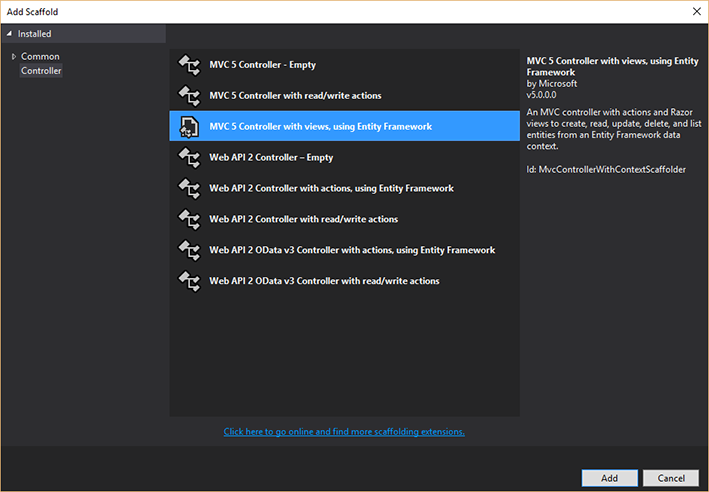
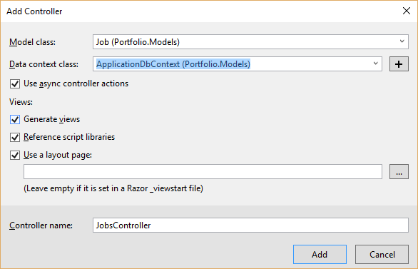

# Storing jobs

In other Entity Framework tutorials, you may have encountered the setup process for the `DbContext`, adding a new one, adding `DbSet`s to it, and so on. In our portfolio application, however, we've been given a lot of that as part of the scaffolding for authentication. During setup, Visual Studio creates the database so that it can store user accounts, password hashes and email addresses. Since adding a new `DbContext` just for our tables is unnecessarily complex, for simple applications we can just piggy-back on top of the `ApplicationDbContext` that has been created for us.

In Solution Explorer, go to `Models` / `IdentityModel.cs`. You should see two classes, the second of which looks like this:

```cs
public class ApplicationDbContext : IdentityDbContext<ApplicationUser>
{
    public ApplicationDbContext()
        : base("DefaultConnection", throwIfV1Schema: false)
    {
    }

    public static ApplicationDbContext Create()
    {
        return new ApplicationDbContext();
    }
}
```

In Entity Framework Code First, any `DbSet<T>` we add to this class _will be stored in the database as a new table_. The idea is that we can just create types (like `Job`) and store collections of those types without having to worry too much about the mechanics of SQLServer.

In theory it might be cleaner to put the `ApplicationDbContext` in its own file, but we can leave it here for now to get things started quickly.


## A note on creating a new DbContext

Be aware that if you decide not to use the existing `ApplicationDbContext`, you _could_ create another one but managing the multiple contexts, enabling and running migrations can be quite a bit more complex for a new user. We suggest you use the existing context until you've had a lot of practice with Entity Framework. There's quite a nice video example of how to organise DbContexts [here](http://pluralsight.com/training/Player?author=scott-allen&name=aspdotnet-mvc5-fundamentals-m6-ef6&mode=live&clip=2&course=aspdotnet-mvc5-fundamentals).


## Migrating changes

Remember Knex migrations? Migrations help you make changes to the database _schema_, or table definitions, in a controlled and reproducible fashion. Each time we add a table or column, or change a column type or name, we add a new migration and update the database with the changes.

You're going to need the Package Manager Console. This is a bit of a multi-function tool, capable of installing and removing NuGet packages but also executing commands the same way [PowerShell](http://docs.nuget.org/ndocs/tools/powershell-reference) does. One of the quickest ways to get to it is to go to the Quick Launch search box in the top right hand corner of Visual Studio and typing the search 'pac'.

Once you have the PMC open, type the command `enable-migrations`. After a bit of a pause, you'll see a file named `Configuration.cs` pop up in the IDE. The most interesting part of this is the `Seed` method, which allows you to define some rows to insert into the database whenever migrations are run, just like Knex seeds (except that there's no separate `seed:run` command).

Next, type `add-migration Initial`.

You'll see something like, _Scaffolding migration 'Initial'._ More importantly, you'll see a migration file pop up in the IDE that is really just a C# version of a Knex migration. Study it for awhile to see how they create the tables (entities). Notice that all the table creation commands for the existing user authentication tables are in the migration. That's ok, it's just because Entity Framework has to be able to reproduce them if you run the migration. They won't be in every migration you ever create, just the first one.

It's important to understand that _nothing has changed in the database yet_. Just like Knex migrations, creating the migration doesn't change the database: you have to run it. In Entity Framework, we use the `update-database` command to do that.  Try it now: you should see a bunch of text including _Applying specific migration: ..._. You'll also see _Running Seed method._

Now the initial migration is out of the way, let's create a Jobs entity in the database. At the top of the `ApplicationDbContext` class, add a new `DbSet` for the `Job` entity:

```cs
public class ApplicationDbContext : IdentityDbContext<ApplicationUser>
{
    public DbSet<Job> Jobs { get; set; }
```

In Package Manager Console, type `add-migration Jobs` and take a look at the migration file that pops up. Then run `update-database` again.


## Loading jobs

Ok, so let's get rid of our static data and start using the database. Initially we put some static data in the `History` method of the `HomeController`. However, now we're going to take advantage of some of Visual Studio's automatic code generation to create a whole series of useful actions and views.

In Solution Explorer, right click on _Controllers_ and select _Add_ / _Controller..._. Choose _MVC 5 Controller with views, using Entity Framework_ from the dialog that pops up and hit the _Add_ button.



In the box that follows, choose `Job` as the model class, `ApplicationDbContext` as the context class, tick the _Use async controller actions_ box, and leave the layout page name empty (it's already set).



