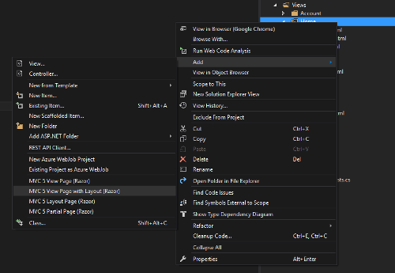

# The 'Work History' page

One of the features we'd like to present in the online portfolio is a chronological summary of your work history. Think about what you see when you visit LinkedIn's summary of experience: that kind of display, only hopefully more engaging!


## View model

Let's start with the data first. Before we do the user-facing pretty stuff, we need to think about what kind of information we're going to need to build the view:

 - A list of jobs
   - Each job should have:
     - start date
     - finish date
     - title
     - description

There are probably other things we might be able to use, but we'll add them as we go. Thinking about what data we might need before doing the cosmetic part of the page helps us think about how the rest of the application will need to be organised. This is a good practice to apply no matter what tech stack you're working with.

Start from the inside-out! Create a new class under _Models_ in Solution Explorer called `Job.cs`. It should just consist of public properties like so:

```cs
using System;

namespace Portfolio.Models
{
    public class Job
    {
        public int Id { get; set; }
        public DateTime Start { get; set; }
        public DateTime Finish { get; set; }
        public string Title { get; set; }
        public string Description { get; set; }
        public DateTime Created { get; set; }
        public DateTime Updated { get; set; }
    }
}
```

Now create a new class under _Models_ `HistoryViewModel.cs`. For now, it should just have a collection of `Job` in it (later there will no doubt be other things to add):

```cs
using System.Collections.Generic;

namespace Portfolio.Models
{
    public class HistoryViewModel
    {
        public ICollection<Job> Jobs { get; set; }
    }
}
```

 - We don't really need all the properties associated with a database record here, like `Id` or `Created`/`Updated`: this model will never be stored in the database, it's strictly for the _view_
 - We use a generic collection which can be converted to something more specific later as required


## Testing the view model

We can write unit tests for our view model because it's returned to us in the `Model` property of the `ViewResult`:

```cs
using System.Web.Mvc;
using Portfolio.Controllers;
using Portfolio.Models;
using Xunit;

namespace PortfolioTests
{
    public class HistoryTests
    {
        [Fact]
        public void HistoryReceivesViewModel()
        {
            // Arrange
            var controller = new HomeController();

            // Act
            var result = controller.History() as ViewResult;
            var model = result?.Model as HistoryViewModel;

            // Assert
            Assert.NotNull(result);
        }
    }
}
```
 - Notice the `?.Model`? That's a [null reference check](https://msdn.microsoft.com/en-us/library/dn986595.aspx).
 
`History` will be red because it doesn't exist yet. We have to create it in `HomeController` like so:

```cs
public ActionResult History()
{
    var vm = new HistoryViewModel();
    return View(vm);
}
```

This, in turn, will complain that the view does not exist. Better create it! Right click _Views_ / _Home_ and choose _Add_ / _MVC 5 View Page with Layout (Razor)_:



Call it `History`, and when it asks you to choose a layout page, select `_Layout.cshtml`. This will create a blank view with a predefined layout (the title bar, menu etc). Write some simple text in the view so you can see it working right away:

```cs
@{
    Layout = "~/Views/Shared/_Layout.cshtml";
}

Hey, it's a work history page!
```

Then run your tests. Hit F5 to launch the site in the debugger and visit `/Home/History` to see it in the browser.


## Resources

 - [The Ultimate Guide To Unit Testing in ASP.NET MVC](http://www.danylkoweb.com/Blog/the-ultimate-guide-to-unit-testing-in-aspnet-mvc-E2) - the writing's not especially strong, but some of the examples are useful. Note that he does not use xUnit, so you might need to modify some of them a little.
